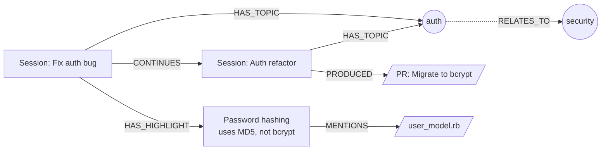

# ctx

Meet `ctx`, your persistent memory for AI coding agents. A local knowledge graph where agents record what they worked on, what they learned, and how it all connects.



## Quick start

```bash
cargo install --path crates/cli

# agent registers itself at session start
ctx add Session session_id=$SID title="Fix auth bug" tool=claude model=opus project_path=/app

# tags what it's working on
ctx add Topic name=auth
ctx link Session:1 HAS_TOPIC Topic:2

# discovers something mid-session
ctx add Highlight content="Password hashing uses MD5, needs bcrypt" kind=discovery
ctx link Session:1 HAS_HIGHLIGHT Highlight:3

# next session picks up the thread
ctx search "auth"
# Session:1 "Fix auth bug" (0.07)

ctx walk Session:1 HAS_HIGHLIGHT
# Highlight:3 "Password hashing uses MD5, needs bcrypt"

# find all sessions working on the same topics
ctx walk Session:1 HAS_TOPIC/'~HAS_TOPIC'
# Session:4 "Auth refactor"
# Session:7 "Add OAuth support"
```

## Traversal

Edge path syntax chains hops with `/`, reverses with `~`, wildcards with `*`.

```bash
ctx walk Session:1 HAS_TOPIC                              # topics for this session
ctx walk Session:1 HAS_TOPIC/'~HAS_TOPIC'                 # sessions sharing topics
ctx walk Session:1 IN_PROJECT/'~IN_PROJECT'/HAS_TOPIC      # all topics in this project
ctx walk Session:1 '*'                                     # everything connected
ctx path Session:1 Session:9 --via CONTINUES               # shortest path
# Session:1 >CONTINUES> Session:4 >CONTINUES> Session:9  (2 hops)
```

## Filters

```bash
ctx find Session tool=claude,model=opus    # AND
ctx find Highlight kind=blocker            # enum
ctx find Session 'title~auth'              # contains
ctx find Session 'title^Fix'               # starts with
ctx find Session tool!=codex               # not equal
```

## Schema

Typed properties with hints so agents know what to fill in.

```
$ ctx schema Highlight
Highlight (2 required, 1 optional)
  content    string   — The key point in one sentence
  detail     string?  — Full context: why this matters, what led to it
  kind       enum: discovery, decision, blocker, insight, todo

  edges in:  HAS_HIGHLIGHT ← Session
  edges out: HAS_TOPIC → Topic
  edges out: MENTIONS → Artifact
  edges out: REFERENCES → Session, Highlight
```

| Node | What it is |
|---|---|
| Session | A coding session (Claude, Codex, etc.) |
| Highlight | A key moment: discovery, decision, blocker, insight, or todo |
| Topic | A concept (e.g. "auth", "database") |
| Artifact | A file, PR, issue, or document |
| Project | A codebase |
| Branch | A git branch |

## Commands

```
ctx add <Kind> key=value...              create a node
ctx get <Kind:id>                        show node + edges
ctx set <Kind:id> key=value...           update (key=null to remove)
ctx rm <Kind:id>                         delete node + edges

ctx link <ref> <Edge> <ref> [props]      create edge
ctx unlink <ref> <Edge> <ref>            remove edge
ctx edge-set <ref> <Edge> <ref> props    update edge properties
ctx edges <ref> [--in|--out] [--kind K]  list edges

ctx find <Kind> [filters] [--limit N]    filter nodes
ctx search <text> [--kind K]             full-text search
ctx count <Kind> [--by prop]             count or group-by

ctx walk <ref> <edge-path> [--limit N]   traverse graph
ctx path <ref> <ref> [--depth N]         shortest path

ctx schema [Kind]                        show schema + hints
ctx kinds                                node counts by type
ctx stats                                totals
```
